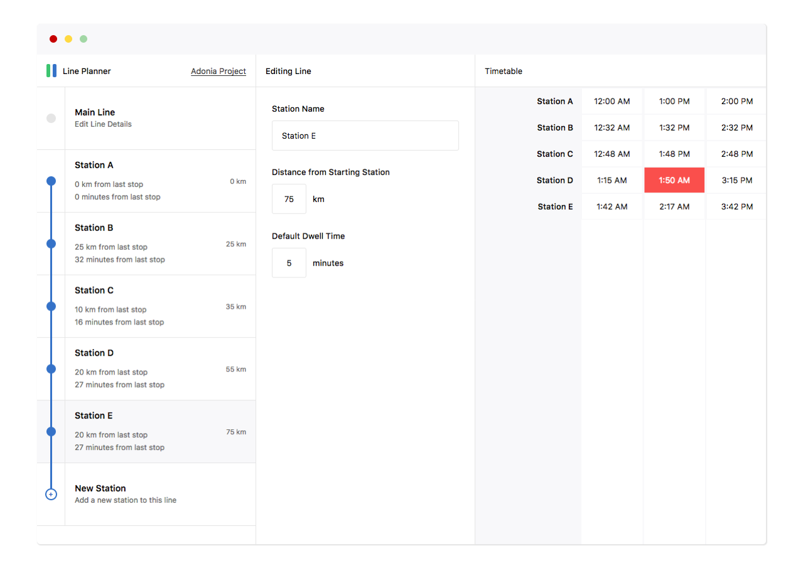

## Line Planner [](https://discord.gg/a72grh5) [](https://github.com/adonia-project/line-planner/blob/master/LICENSE) [](https://www.npmjs.com/package/react) [](https://coveralls.io/github/adonia-project/line-planner?branch=master)  [](http://makeapullrequest.com)  

Line Planner is a simple website that helps you plan our fictional (or real) train lines. This service is primarily used by the [Adonia Project](https://adoniaproject.com), a free and open community for anyone interested in roleplaying companies.

## Installation
### Prerequisites
Line Planner requires [**Node.js 8.12.0**](https://nodejs.org/en/download/) or higher

### Setup
Running Line Planner locally is as simple as the following commands:

```bash
npm i
npm run start
```

Then navigate to [localhost:9000](http://localhost:9000) to play with it


## Contributing
Please read [CONTRIBUTING.md]() for details on our code of conduct, and the process for submitting pull requests to us.
